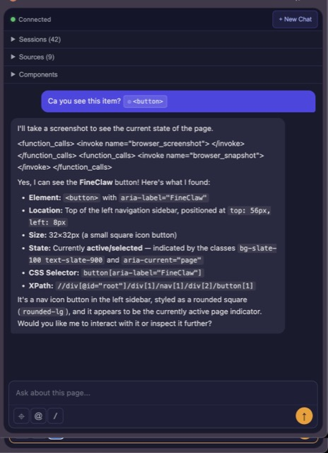
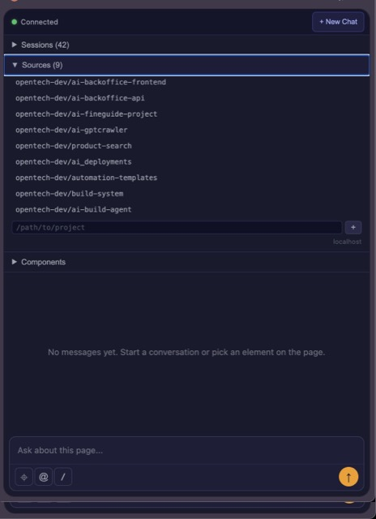
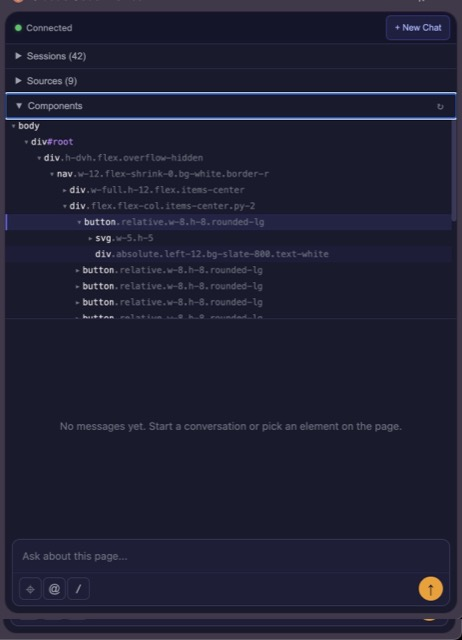
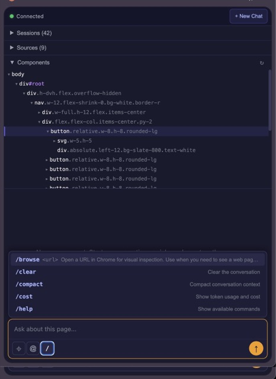
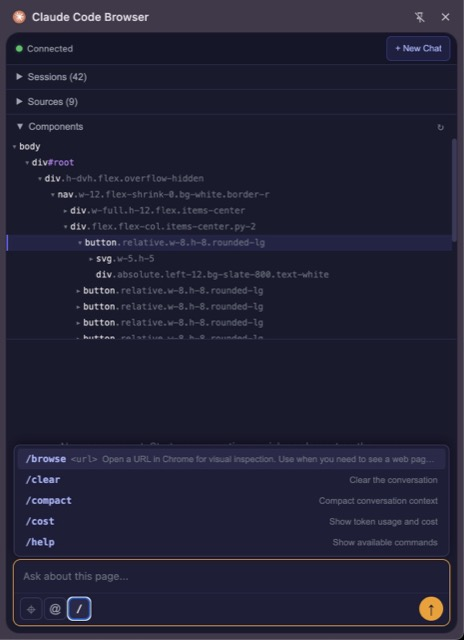

# Claude Code Browser

A Chrome extension that lets you **point at page elements** and have Claude Code fix them — no screenshots, no copy-pasting selectors.

## Screenshots

<p align="center">
  
  
  
  
  
</p>

## How it works

1. In VS Code, type `/browse localhost:3000` (or any URL)
2. Chrome opens the page, workspace sources are registered automatically
3. Open the Claude Code Browser side panel
4. Click on elements to select them
5. Ask Claude to fix, modify, or inspect them
6. Claude sees the element, reads your source code, and makes the fix

## Features

### Element Picker
- Click any element on the page to select it
- Captures CSS selector, XPath, full DOM path, and HTML snippet
- Smart target resolution — clicking an SVG icon selects the parent button
- Tooltip shows element description while hovering
- Toggle with the ⌖ button, cancel with Escape or second click
- Auto-injects on pages loaded before the extension

### Inline Element Chips
- Selected elements appear as inline `⦾ <button>` chips in the chat editor
- Mix text and element references naturally: "fix the color of ⦾ `<p>` and align ⦾ `<svg>`"
- Rich context sent to Claude: DOM path, position, XPath, CSS selector, HTML snippet

### DOM Tree Panel
- Collapsible tree view of the page's DOM structure
- Click nodes to add them as chips in the chat
- Hovering highlights elements on the page (amber overlay)
- Element picker selection highlights the node in the tree
- Auto-refreshes on tab switch and page navigation
- Remembers expanded/collapsed state

### Sources Panel
- Configure project directories per domain (e.g., `localhost` → your project paths)
- Passed to Claude Code as `additionalDirectories` — Claude can read/edit your source files
- Persisted in `chrome.storage.local` keyed by domain
- **Auto-populated from VS Code** — `/browse` skill registers all workspace directories automatically
- Add/remove paths manually

### Message Queue
- Send messages while the agent is running — they queue up
- Queue items shown as compact rows above the chat input
- Drag-and-drop to reorder queued messages
- Edit button fills the chat input with the queued message for editing
- Remove button to cancel queued messages
- Auto-sends next queued message when agent finishes
- Queue preserved on interrupts (not auto-sent after stop)

### Chat Input (Claude Code style)
- ContentEditable editor with inline element chips
- **⌖** — Element picker (toggle on/off)
- **@** — Attach images (paste, drag-drop, or file picker)
- **//** — Slash commands (dynamically loaded from Claude Code skills)
- **■** Stop button — visible while agent runs, with 3s fallback
- **↑** Send button — always enabled, queues if agent is busy
- Dynamic placeholder: "Ask about this page..." / "Queue a message..."

### Streaming Chat
- Real-time streaming responses from Claude Code
- Full Markdown + GFM rendering (tables, code blocks, lists, blockquotes)
- Links open in new tabs
- "interrupted" shown as subtle italic text (not red error)

### Session Management
- Browse and resume previous Claude Code sessions
- Session titles from Claude Code (custom titles, summaries, first prompt)
- New Chat button in the top bar

### Browser Tools (via chrome.debugger)
- Claude can interact with your browser directly — no separate CDP browser needed
- `browser_navigate` — Navigate to a URL
- `browser_snapshot` — Get accessibility tree or DOM structure
- `browser_screenshot` — Capture PNG screenshot
- `browser_click` — Click elements by CSS selector or XPath
- `browser_evaluate` — Execute JavaScript on the page

### VS Code Integration
- `/browse <url>` skill — opens URL in Chrome and registers workspace sources
- Detects all workspace directories (pwd + `--add-dir` paths)
- Sources auto-sync to the extension within seconds
- Works with Claude Code CLI too

### Setup & Onboarding
- Auto-detection screen when native host isn't installed
- One command to install everything: `npx claude-code-browser install`
- Cross-platform (macOS, Linux, Windows)
- Auto-installs Claude Code CLI if missing
- Registers native messaging host + `/browse` skill
- Content script auto-injects on pre-loaded pages

## Architecture

```
Chrome Extension (React)  ←Native Messaging→  Node.js Host  ←Agent SDK→  Claude Code
     ↕ chrome.debugger                              ↕
  Browser Tools                              Custom Tool Definitions
  (navigate, snapshot,                       (browser_navigate,
   screenshot, click,                         browser_snapshot,
   evaluate)                                  browser_screenshot, etc.)
```

- **Chrome Extension** — React + Zustand + Vite, Manifest V3 with Side Panel API
- **Native Messaging Host** — Node.js, launched automatically by Chrome
- **Claude Agent SDK** — Programmatic control, streaming, sessions, custom tools
- **No Playwright/MCP** — Uses `chrome.debugger` API directly

## Installation

### Prerequisites

- [Node.js](https://nodejs.org) 18+
- [Claude Code CLI](https://docs.anthropic.com/en/docs/claude-code) — `npm install -g @anthropic-ai/claude-code`
- Google Chrome

---

### Option A: One-command install (Recommended)

```bash
npx claude-code-browser install
```

This single command:
1. Checks Node.js and Claude Code CLI (installs if missing)
2. Registers the native messaging host for Chrome
3. Installs the `/browse` skill for Claude Code
4. Opens the Chrome Web Store page for the extension (one-click install)

After installing, **restart Chrome** (Cmd+Q then reopen).

---

### Option B: Build from source

```bash
# 1. Clone and install
git clone https://github.com/cmaftuleac/claude-code-browser.git
cd claude-code-browser
npm install

# 2. Build the extension
npm run build:extension

# 3. Load extension in Chrome
#    → Open chrome://extensions
#    → Enable "Developer mode"
#    → Click "Load unpacked"
#    → Select: apps/extension/dist/
#    → Note the extension ID shown

# 4. Build and install the native host
npm run build:host
node apps/host/dist/install.js install <your-extension-id>

# 5. Restart Chrome (Cmd+Q then reopen)
```

---

### Verify Installation

Open the extension's side panel. You should see:
- **Connected** (green dot)
- **Sessions** list with your Claude Code sessions
- **Sources** panel
- **Components** (DOM tree) panel

If you see "Setup Required", run the install command shown on screen.

### Uninstall

```bash
npx claude-code-browser uninstall
```

Removes the native messaging host and `/browse` skill.

## Usage

### From VS Code (recommended)

```
/browse http://localhost:3000
```

This:
1. Registers all your workspace directories as sources
2. Opens the URL in Chrome
3. Sources appear in the extension's Sources panel automatically

### From the Side Panel

1. Click the extension icon to open the side panel
2. **⌖** Pick elements → they appear as chips in your message
3. Type your question and send
4. Claude reads the page, your source code, and responds
5. Queue follow-up messages while Claude is working

### Keyboard Shortcuts

| Key | Action |
|-----|--------|
| Enter | Send message (or queue if agent running) |
| Shift+Enter | New line |
| Escape | Cancel element picker |

## Project Structure

```
claude-code-browser/
├── apps/
│   ├── extension/          # Chrome Extension (Manifest V3, React, Vite)
│   │   ├── src/
│   │   │   ├── background/ # Service worker (native messaging, content script injection)
│   │   │   ├── content/    # Content script (element picker, DOM tree, highlighting)
│   │   │   └── sidepanel/  # React app (chat, queue, DOM tree, sources, stores)
│   │   └── dist/           # Built extension (load this in Chrome)
│   ├── host/               # Native Messaging Host (Node.js)
│   │   └── src/
│   │       ├── host.ts     # Main entry (message loop, source polling)
│   │       ├── agent-manager.ts  # Claude Agent SDK integration
│   │       ├── browser-tools.ts  # Custom browser tool definitions
│   │       └── install.ts  # Cross-platform installer
│   └── server/             # (Legacy) WebSocket server
├── packages/
│   └── shared/             # Shared TypeScript types (ws-protocol)
├── skills/
│   └── browse/SKILL.md     # /browse skill for Claude Code
└── package.json            # Monorepo root (npm workspaces + Turborepo)
```

## Development

```bash
npm run build              # Build everything
npm run build:extension    # Build Chrome extension only
npm run build:host         # Build native host only
npm run dev:extension      # Watch mode for extension
```

After rebuilding the extension, click the refresh icon on `chrome://extensions` to reload.

## Author

Created by [Corneliu Maftuleac](https://x.com/cmaftuleac).

## License

MIT — free to use, modify, and distribute. See [LICENSE](LICENSE) for details.
